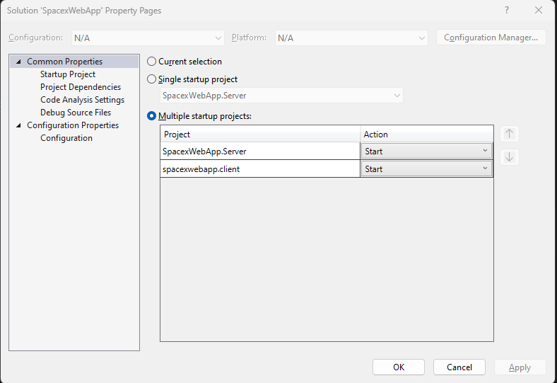

# SpacexWebpp
<p>This is a web application made with ASP .Net Core with .Net 8 and Angular 17.</p>

 - Prerequisites: 
   - Visual studio (I used 2022 version)
   - Node js - Latest

### Starting the project

1. Open the project in visual studio
2. Navigate to ````SpacexWebApp/spacexwebapp.client```` and run ```` npm install ````
3. Make sure to configure the startup proj to run multiple startup projects:
